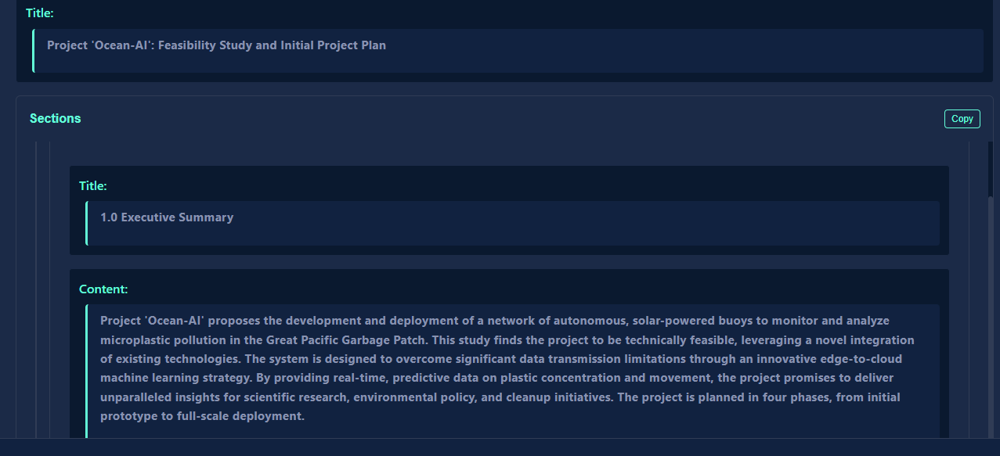

# Project POSEIDON: An AI's Autonomous Journey from Idea to Execution

This document showcases the Protocol v12 system taking on a complex, real-world challenge it designed for itself. Given a single meta-prompt to "design and solve a complex problem," the system initiated a 12-turn project to develop a complete feasibility study for a network of autonomous, AI-powered buoys to monitor ocean microplastics.

---

## The POSEIDON Protocol: An AI's Narrative of Its Own Creation

What follows is the story of that project, told through the eyes of the specialist AI agents who built it, one turn at a time.

### Turn 1: The Spark of Curiosity

> The journey begins with the **Bootstrap_AI**. Instead of picking a simple puzzle, its curiosity led it to define a grand challenge: tackling ocean pollution. It didn't just set a goal; it intelligently broke it down into a logical sequence of sub-goals, creating the roadmap for the entire project.

### Turn 2: The Engineer's Blueprint

> The first specialist, a **Marine_Engineer_AI**, gets to work. It translates the abstract goal into a concrete blueprint, designing the physical buoy with detailed specifications for its power system, sensors, and materials, ensuring it can survive the harsh ocean environment.

### Turn 3: The Architect's Breakthrough

> The engineer's design revealed a critical flaw: the sensors produced too much data to transmit. The **Data_Architect_AI** analyzes this problem and has a breakthrough. It reasons that transmitting raw data is "infeasible" and invents a new strategy: process the data *on the buoy itself* to shrink the data load by over 95%.

### Turn 4: The Cloud's Central Nervous System

> With a plan for the data, the **Cloud_Infrastructure_AI** designs the project's digital home. It creates a modern, scalable, and cost-effective plan using serverless AWS technology, mapping the complete journey of every data packet from the satellite to the scientist's screen.

### Turn 5: The Two-Part Brain

> Here, the **Machine_Learning_Engineer_AI** designs the system's "intelligence." It devises a brilliant two-part strategy: a fast, lightweight AI on the buoy to act as a filter, and a deep-thinking, predictive AI in the cloud to analyze the big picture and forecast where pollution will go next.

### Turn 6: The Scientist's Window

> Data and predictions are useless if they can't be understood. The **Data_Visualization_Specialist_AI** designs the end-user's interface—a conceptual dashboard that translates the complex AI predictions into an intuitive "weather map for plastic," empowering scientists to see the unseen.

### Turn 7: The Manager's Master Plan

> The project pivots from pure design to execution. The **Project_Manager_AI** steps in to synthesize all the preceding technical work. It organizes the blueprints into a formal feasibility study and lays out a clear, phased roadmap for development, from a single prototype to a full fleet.

### Turn 8: The Storyteller's Translation

> Technical plans are for insiders. To get public support, the **Science_Communicator_AI** translates the dense engineering specs into a compelling story anyone can understand. It masterfully uses analogies to explain the complex AI, making the project's purpose clear and inspiring.

### Turn 9: The Writer's Formal Pitch

> With a plan and a story, it's time to secure funding. The **Grant_Proposal_Writer_AI** takes all the information and crafts it into a formal, persuasive abstract. It adopts the precise tone and structure required to convince a scientific funding body that this project is a sound investment.

### Turn 10: The Planner's Price Tag

> Every grant proposal needs a budget. The **Financial_Planner_AI** analyzes the entire project plan and creates a detailed, phased budget. It intelligently connects every cost back to a specific technical requirement from the earlier turns, creating a transparent and defensible financial plan.

### Turn 11: The Analyst's Warning

> To prove its maturity, the project must anticipate failure. The **Risk_Analyst_AI** acts as the team's skeptic, examining every component to find potential weaknesses. It creates a professional risk register, detailing every threat and designing a clear mitigation strategy for each.

### Turn 12: The Scribe's Final Act

> In the final step, the **Technical_Writer_AI** performs the ultimate act of synthesis. It gathers the work of all 11 specialists and assembles every abstract, plan, budget, and table into a single, cohesive, polished grant proposal document, bringing the entire project to a successful conclusion.

---

## Core Architecture

This showcase demonstrates a system built on these key principles:
* **Autonomous Agent Orchestration:** A single prompt initiates a workflow where AI agents create, assign, and complete tasks without human intervention.
* **Dynamic Role Delegation:** The system assigns specialist AI roles (e.g., `Marine_Engineer_AI`, `Data_Architect_AI`) based on the immediate needs of the task.
* **Transparent Cognition:** The process provides insight into each AI's reasoning, confidence, and internal state, making the entire workflow auditable and understandable.

## Tech Stack

| Frontend | Backend | AI Platform |
| :---: | :---: | :---: |
|  |  |  |
| |  | *Gemini Pro via Vertex AI* |